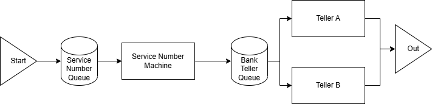
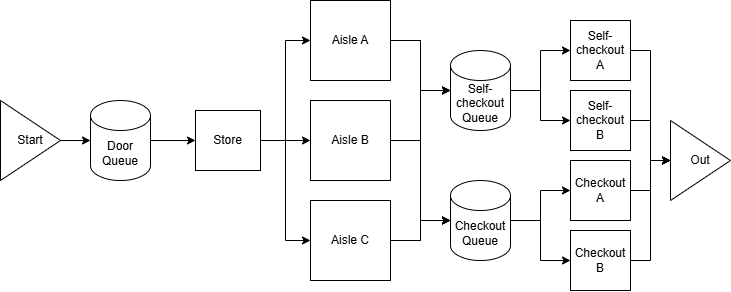

## Bank service diagram
> Clients wait in queue to get a service number  
> Clients wait until their service number if called.  
> Clients get serviced and leave the bank.

# Store service diagram
> Customers wait in queue to enter the store  
> Customers pick which aisle they want to go to  
> Customers pick if they want to go to self or service checkout.  
> Customers wait in queue to be serviced.  
> Customers leave.
